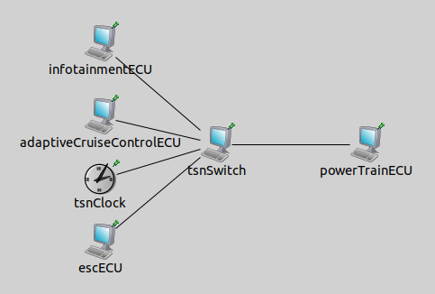

# Omnet++ Automotive TSN Network

## 💻 Network Requirements

### OMNeT++ 6.3.0

Omnet++ is an open source Simulation tool. 

To install Omnet++, follow the steps in the link bellow:

- [Omnet++ Installation Guide](https://omnetpp.org/download/)

### INET Network Library

INET is an Omnet++ Simulation library.

To install INET, follow the steps in the link bellow:

- [INET Installation Guide](https://inet.omnetpp.org/Installation.html)

## Workspace Setup

### Creating a Workspace

Create an Omnet++ workspace and link the INET installation to it.

To create a workspace and link the INET to it, follow the guides bellow:

- [Omnet++ Introduction Guide](https://inet.omnetpp.org/docs/users-guide/ch-introduction.htmlhtml)
- [INET Introduction Guide](https://inet.omnetpp.org/docs/users-guide/ch-usage.html)

### Project Setup


#### Cloning 

To use this project, first;

```
git clone https://github.com/paivalucass/Automotive_TSN_Omnetpp_Network.git
```

#### Importing 

In the Omnet++ interface, go to:

**Files > Import > General > Existing Projects into Workspace**

Select the directory where you cloned the repository.

#### Linking to the INET library 

In the Omnet++ Workspace, right click this project's folder and go to:

**Preferences > Project references**

Mark the INET library as a project reference.

## Network Simulation 

### Topology

This Network consists of 4 Ethernet nodes and 1 Switch. The nodes are simulating 4 ECU's:

- Infotainment 
- Adaptive Cruise Control
- ESC 
- Powertrain 



### TSN Features

The following TSN features are being used in this Simulation:

- Time Synchronization (gPTP)
- Per-Stream Filtering
- Time-Aware Shaper (GCL)

7 types of traffic are implemented, each with a different PCP priorities (1 - 7). 

### Running 

To run the project, in the simulations folder, right click the **ivn_tsn.ini** file and run as **Omnet++ Simulation**.

**Attention!** If it is the first time you're running this project, it will take some time to build. 

## 🤝 Colaboradores

Agradecemos às seguintes pessoas que contribuíram para este projeto:

<table>
  <tr>
    <td align="center">
      <a href="#" title="defina o título do link">
        <br>
        <sub>
          <b>Iuri Silva</b>
        </sub>
      </a>
    </td>
    <td align="center">
      <a href="#" title="defina o título do link">
        <br>
        <sub>
          <b>Mark Zuckerberg</b>
        </sub>
      </a>
    </td>
    <td align="center">
      <a href="#" title="defina o título do link">
        <br>
        <sub>
          <b>Steve Jobs</b>
        </sub>
      </a>
    </td>
  </tr>
</table>
